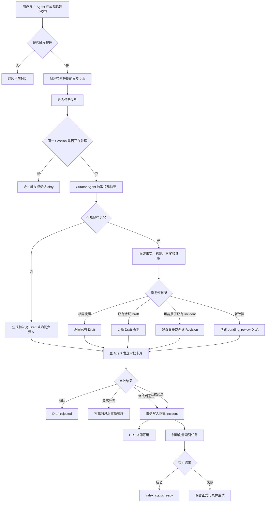

# RecallOps 完整流程与分支设计

## 1. 项目是什么

RecallOps 是运行在飞书 OpenClaw 场景中的研发故障记忆系统。它把一次故障从“多人在群聊中讨论”转化为“经过审批、能够检索、带原始证据、可以持续修订的团队记忆”。

系统不是把全部聊天直接写入向量库，也不是在用户提问时只做一次简单 RAG。它管理的是完整的记忆生命周期：

```text
故障发生
→ 在话题 Session 中协作排查
→ 自动或手动触发整理任务
→ Curator Agent 异步整理候选事实
→ 判断重复、补充或新故障
→ Draft 等待用户审批
→ 事务化写入正式记忆
→ 全文检索立即可用、向量索引异步更新
→ 用户查询历史故障
→ 权限过滤、混合召回和证据回答
→ 结论变化后创建 Revision 并重新索引
```

系统的核心原则是：

> Agent 负责降低整理成本，用户负责确认事实，后端负责权限和一致性，数据库保存正式记忆，检索索引只是可以重建的派生数据。

## 2. 系统中的角色

| 角色 | 主要职责 | 不能做什么 |
|---|---|---|
| 飞书用户 | 排查故障、查询历史、审批或修正草稿 | 不能伪造 Workspace 和他人身份 |
| 主 Agent | 理解用户意图、触发工具、展示进度和审批结果 | 不直接写数据库，不自主批准根因 |
| Trigger Service | 接收告警恢复、工单关闭和话题静默事件 | 不生成故障结论 |
| Curator Agent | 从当前故障话题提取候选事实和证据 | 不决定权限，不直接提交正式记忆 |
| Memory Service | 权限、状态机、幂等、事务、检索和修订 | 不依赖模型决定安全边界 |
| PostgreSQL | 保存 Draft、Incident、证据、Revision 和任务 | 不把向量作为事实源 |
| Index Worker | 生成或更新 Embedding | 失败时不能破坏正式 Incident |

## 3. Session、用户与记忆边界

### 3.1 Session 不是按用户划分

在飞书群聊中，一次故障通常由多个人共同处理，因此采用话题级 Session：

```text
Tenant
└── Workspace
    └── Group
        └── Topic/Thread = 一个故障 Session
```

同一个话题中的研发、测试和运维共享上下文。系统同时记录每次操作的真实用户身份，用于判断谁可以生成 Draft、审批、查询或修正。

### 3.2 长期记忆不属于 Session

Session 是短期协作上下文；正式 Incident 属于 Workspace，是团队共享的长期记忆。

```text
Session：这次对话正在处理什么故障
User：当前操作是谁发起的
Workspace：正式记忆归哪个团队、谁有权访问
```

Session 关闭不会删除已经确认的 Incident。

## 4. 完整主流程



下面逐阶段说明所有主要分支。

## 5. 阶段一：主 Agent 与用户交互

用户可能有四类意图。

### 情况 A：查询历史故障

```text
用户：支付成功后订单一直不更新，以前发生过吗？
```

主 Agent 调用 `incident_search`，进入查询流程，不启动整理 Agent。

### 情况 B：明确要求整理

```text
用户：帮我把这次故障沉淀下来。
```

主 Agent创建异步整理任务，并立即返回任务已受理，不阻塞当前对话。

### 情况 C：当前故障尚未结束

```text
用户：先记录一下，现在还不确定是不是数据库问题。
```

主 Agent可以创建“调查中”的临时 Draft，但不能作为正式 Incident 入库，也不能把数据库问题写成最终根因。

### 情况 D：普通聊天

```text
用户：今天发布窗口几点开始？
```

不触发 RecallOps，避免对所有群聊内容进行无意义整理。

## 6. 阶段二：自动触发整理

系统使用事件驱动，避免定期拉取所有 Session 的全部消息。

### 6.1 强触发

以下事件可以直接创建整理候选任务：

- 告警平台发送 `incident_resolved`；
- 故障工单变为 `resolved` 或 `closed`；
- 负责人点击“生成故障总结”；
- 话题中出现标准化的“故障已恢复”命令。

### 6.2 弱触发

每次话题出现新消息，只更新 Session 状态：

```text
last_message_at
last_message_id
message_count
has_recovery_signal
next_check_at
```

通过延迟防抖判断话题是否暂时结束：

```text
10:00 新消息 → 计划 10:30 检查
10:20 又有消息 → 延后到 10:50
10:50 没有新消息 → 执行整理资格检查
```

### 6.3 定时任务

定时 Sweeper 只做异常兜底：

- 检查达到静默时间却未触发的 Session；
- 回收 Worker 崩溃后超时的任务；
- 重试失败的索引任务；
- 提醒即将过期的 Draft。

它不周期性读取所有飞书聊天历史。

### 6.4 触发资格分支

触发后先进行确定性判断：

```text
是否来自白名单群？
├─ 否 → 忽略并记录审计原因
└─ 是
   是否存在合法 Workspace？
   ├─ 否 → 拒绝
   └─ 是
      是否已经处理到当前消息游标？
      ├─ 是 → 不重复创建任务
      └─ 否
         是否达到最低整理条件？
         ├─ 否 → 继续等待或提醒补充
         └─ 是 → 创建异步任务
```

## 7. 阶段三：任务队列和并发

### 7.1 任务什么时候进入队列

队列位于 Curator Agent 之前：

```text
触发事件 → 资格检查 → 创建 Job → Worker 领取 → Agent 整理
```

不是 Agent 整理完成或查询失败后才进入队列。

Job 示例：

```json
{
  "job_type": "curate_incident",
  "tenant_id": "tenant-a",
  "workspace_id": "payment-team",
  "thread_id": "thread-1024",
  "source_cursor": "msg-120",
  "trigger_type": "incident_resolved",
  "triggered_by": "user-18",
  "status": "pending"
}
```

幂等键：

```text
tenant_id + workspace_id + thread_id + source_cursor
```

相同的飞书事件或告警事件被重复投递时，只生成一个 Job。

### 7.2 是否一个一个处理

不同 Session 并行：

```text
Session A → Worker 1
Session B → Worker 2
Session C → Worker 3
```

同一 Session 串行：

```text
Session A Task 1 → 完成 → Session A Task 2
```

小规模阶段可以使用 PostgreSQL Job Queue：

```sql
SELECT id
FROM jobs
WHERE status = 'pending'
ORDER BY created_at
FOR UPDATE SKIP LOCKED
LIMIT 1;
```

### 7.3 Agent 处理期间出现新消息

状态表保存：

```text
processing_cursor
latest_message_cursor
dirty
```

分支如下：

```text
处理期间没有新消息
→ 正常生成 Draft

处理期间出现新消息
→ dirty=true
→ 当前任务完成
→ 使用新消息增量刷新同一 Draft
→ 不并发生成第二份 Draft
```

### 7.4 Worker 异常

```text
临时网络错误 → 指数退避重试
Agent 输出格式错误 → 重新提示一次，仍失败则标记 failed
飞书来源无权限 → needs_permission，不继续整理
多次失败 → dead_letter，交给人工处理
Worker 崩溃 → lease 超时后由其他 Worker 重新领取
```

## 8. 阶段四：Curator Agent 整理

### 8.1 输入范围

Agent 只读取：

- 当前 Tenant 和 Workspace；
- 当前 Group Topic；
- 当前消息游标之前的快照；
- 当前调用身份有权访问的复盘材料。

每条消息保留：

```text
message_id、sender_id、timestamp、content、source_url、content_hash
```

### 8.2 信息分类

Agent 需要区分：

| 类型 | 示例 | 是否可以直接成为正式结论 |
|---|---|---|
| 故障事实 | 支付成功但订单未更新 | 审批后可以 |
| 初步猜测 | 可能是消息队列延迟 | 不可以 |
| 已排除项 | 队列没有明显积压 | 可作为排查过程 |
| 最终根因 | 连接池连接未释放 | 审批后可以 |
| 临时方案 | 重启消费者恢复业务 | 审批后可以 |
| 长期行动项 | 增加连接池告警 | 审批后可以 |
| 待验证项 | 可能与流量突增有关 | 只能标为待验证 |

### 8.3 信息完整性分支

```text
现象、根因、方案、证据完整
→ 生成完整 Draft

有现象和恢复结果，但根因缺失
→ root_cause=待确认
→ 主 Agent 询问负责人

存在多个互相冲突的根因
→ 保留 conflict 列表
→ 不由 Agent 自主选择

只有少量聊天，没有明确故障
→ 不生成正式 Draft
→ 标记 insufficient_context
```

Agent 输出示例：

```json
{
  "title": "支付回调积压导致订单状态未更新",
  "symptom": "支付成功但订单长时间没有更新",
  "root_cause": "连接池超时配置错误导致连接未释放",
  "resolution": "重启消费者并调整连接池配置",
  "services": ["payment-service"],
  "error_codes": ["PAYMENT_5032"],
  "actions": ["增加连接池使用率告警"],
  "uncertainties": [],
  "evidence": [
    {"field": "root_cause", "message_id": "msg-118"},
    {"field": "resolution", "message_id": "msg-120"}
  ]
}
```

## 9. 阶段五：重复、补充还是新故障

Curator 输出后不能只用向量搜索判断是否重复，因为相似故障可能是两次独立事件。

### 9.1 相同触发或相同消息快照

判断依据：

```text
workspace_id + thread_id + source_cursor + content_hash
```

完全相同：返回已有 Job 或 Draft，不重复创建。

### 9.2 当前 Session 已有活跃 Draft

```text
新消息没有改变事实
→ 保持原 Draft

新消息补充根因或方案
→ 更新原 draft_id
→ draft_version + 1
→ 旧审批失效，通知用户重新确认
```

### 9.3 可能属于已有正式 Incident

通过告警 ID、工单 ID、服务名、错误码、时间范围和语义相似度找到候选后，给用户三个选择：

```text
作为一次新的故障入库
作为已有 Incident 的 Revision
只建立关联，不重复入库
```

系统不能仅因为相似度高就自动合并。相同错误码可能在不同日期出现多次，也可能根因不同。

### 9.4 全新故障

没有相同 Job、活跃 Draft 或明确对应的 Incident 时，创建 `pending_review` Draft。

## 10. 阶段六：Draft 暂存和唯一性

Draft 保存在 PostgreSQL，不放在 Agent 内存，也不进入正式向量检索。

主要字段：

```text
draft_id
tenant_id
workspace_id
thread_id
status
draft_version
structured_payload
source_message_ids
source_cursor
content_hash
created_by
expires_at
reviewed_by
review_comment
```

状态机：

```text
scheduled
→ processing
→ pending_review
   ├→ needs_more_info → processing
   ├→ rejected
   ├→ expired
   └→ approved → committed
```

一个 Session 不出现多个活跃 Draft，依靠四层机制：

1. Job 幂等键避免重复任务。
2. Session 行锁避免两个 Worker 同时整理。
3. 部分唯一索引限制一个话题只能有一个活跃 Draft。
4. 内容哈希避免相同消息快照重复生成。

```sql
CREATE UNIQUE INDEX uq_active_draft_per_thread
ON incident_drafts(tenant_id, workspace_id, thread_id)
WHERE status IN ('processing', 'pending_review', 'needs_more_info');
```

## 11. 阶段七：用户审批

主 Agent 在原话题发送审批卡片：

```text
RecallOps 已整理本次故障

现象：支付成功但订单未更新
根因：连接池超时配置错误
方案：重启消费者并调整配置
行动项：增加连接池使用率告警
证据：3 条原始消息

[通过并入库] [修改后入库] [要求补充] [驳回]
```

### 分支 A：直接通过

用户具有 Maintainer 权限，Draft 字段和证据完整，进入正式提交。

### 分支 B：修改后通过

修改内容与 Draft 一起提交，正式记录保存修改后的值，并保留审批人。

### 分支 C：要求补充

Draft 变为 `needs_more_info`，主 Agent 询问缺失字段。补充信息到达后，更新同一 Draft 版本。

### 分支 D：驳回

Draft 变为 `rejected`，不进入正式检索。保留驳回原因，避免相同消息再次自动生成。

### 分支 E：无人审批

到期前提醒一次；到期后变为 `expired`，不能直接提交。用户需要重新生成或刷新消息快照。

### 分支 F：没有审批权限

普通 Member 可以生成 Draft，但提交时后端返回拒绝，并提示选择有 Maintainer 权限的负责人。

### 自动审批

默认不自动审批根因和解决方案。可以自动确认的主要是结构化字段：

```text
告警 ID、发生时间、恢复时间、服务名、错误码、来源链接
```

只有当正式复盘或已关闭工单被企业定义为权威事实源，并且字段完整、证据齐全、没有冲突、Workspace 显式开启策略时，才能条件自动审批，同时记录策略 ID 和审批原因。

## 12. 阶段八：事务化写入正式记忆

审批请求携带：

```text
可信用户身份
tenant_id / workspace_id
draft_id
confirm=true
request_id
用户修正内容
```

后端检查顺序：

```text
身份是否来自可信 OpenClaw Runtime？
├─ 否 → 401
└─ 是
   是否属于当前 Workspace？
   ├─ 否 → 404，避免暴露记录存在
   └─ 是
      是否具有 Maintainer 权限？
      ├─ 否 → 403
      └─ 是
         confirm 是否为 true？
         ├─ 否 → 拒绝正式写入
         └─ 是
            Draft 是否有效？
            ├─ 否 → 返回过期或状态错误
            └─ 是 → 锁定 Draft 并提交
```

同一事务写入：

```text
Incident
Service / IncidentService
Source Evidence
Action
RequestRecord
Index Job
Draft.status = committed
```

### 写入异常分支

```text
任意数据库步骤失败
→ 整个事务回滚
→ Draft 仍可重新提交

客户端超时后重试相同 request_id
→ 返回第一次提交结果
→ 不生成第二条 Incident

两个人同时确认同一 Draft
→ 第一个请求获得 Draft 行锁
→ 第二个等待后读取已有 Incident
```

## 13. 阶段九：写入后的索引可见性

正式 Incident 是事实源，FTS 和 Embedding 是索引。

```text
事务提交成功
├→ Incident ID 立即可读取
├→ PostgreSQL FTS 立即可用
└→ Vector Job 异步执行
```

状态变化：

```text
index_status=pending
→ processing
→ ready
   └→ failed → retrying → ready/dead_letter
```

### 向量尚未完成时立即查询

系统不会阻塞用户，也不需要替换整套“正在使用的记忆库”：

- 通过 Incident ID 可以立即读取；
- FTS 可以立即命中标题、服务名和错误码；
- 当前 Session 可以直接引用刚确认的 Incident；
- 向量未 ready 时检索自动降级为 FTS；
- 向量完成后自动加入 Hybrid Retrieval。

### 索引失败

```text
Incident 保留
FTS 继续工作
Vector 暂时不可用
Job 后台重试
超过次数进入 dead_letter 并告警
```

Embedding 模型升级时生成新版本索引，验证完成后切换版本；旧索引可以暂时保留用于回滚。

## 14. 阶段十：用户查询历史故障

用户问：

```text
支付成功后订单一直没有更新，以前出现过吗？
```

### 14.1 身份和权限

OpenClaw Runtime 注入可信用户身份。后端不能信任模型参数或普通客户端自报的 Tenant、Workspace 和 User ID。

权限过滤必须放在召回 SQL 中：

```text
授权范围 → FTS / Vector 召回 → 排名
```

不能先全局召回再过滤，否则未授权内容可能进入候选集、日志或模型上下文，并占据 Top-K。

### 14.2 查询类型分支

```text
包含错误码、服务名、接口路径
→ 精确标识符检测
→ FTS 和字段匹配优先

只有自然语言症状
→ Vector 语义召回
→ FTS 补充关键词结果

同时包含精确线索和症状
→ 两路召回
→ RRF 融合
→ 强标识符优先
```

### 14.3 检索结果分支

```text
高置信结果
→ 返回历史 Incident、根因、方案和 Evidence

多个相似结果
→ 按排名返回多个案例
→ 说明它们的差异

只有低置信结果
→ 明确说“没有找到足够可信的历史案例”
→ 可以提供待验证的相似方向，但不能当作事实

完全无结果
→ 拒答历史根因
→ 询问是否为当前故障创建调查 Session

结果存在但用户无权限
→ 对用户表现为没有可访问结果
→ 不泄露记录标题或是否存在
```

### 14.4 查询未命中是否自动写入

查询未命中不等于应该写入记忆。系统只能建议：

> 没有找到可信的历史案例。是否将当前问题作为一次新的故障调查，并在恢复后生成候选记忆？

用户确认后创建或关联新的故障 Session，后续仍要经过整理和审批流程。

## 15. 阶段十一：Evidence-first 回答

检索上下文只包含已确认 Incident 和有权访问的 Source：

```text
incident_id
revision
confirmed fields
evidence_id
source_url
metadata
```

回答规则：

- 历史事实必须绑定 Evidence ID；
- 当前现象不能直接等同于历史根因；
- 模型推测必须标记为待验证；
- 没有证据时返回 insufficient evidence；
- 用户可以打开原始飞书消息复核。

示例：

> 历史案例 INC-A102 中，相同现象由连接池连接未及时释放导致，当时通过重启消费者和调整超时配置恢复。[证据 E-18] 当前故障是否属于相同根因仍需检查连接池使用率和消费者积压情况。

## 16. 阶段十二：正式记忆修订

复盘后根因发生变化：

```text
旧结论：连接池容量不足
新结论：连接池超时配置错误导致连接没有释放
```

系统不静默覆盖，而是创建 Revision：

```text
incident_id
field
old_value
new_value
reason
changed_by
changed_at
```

### 修订分支

```text
补充低风险元数据
→ 可以按策略自动更新并审计

修改根因或解决方案
→ 需要 Maintainer 审批

新证据与旧结论冲突
→ 保留冲突状态
→ 审批后生成 Revision

正式记录完全错误
→ 归档或标记 invalid
→ 不物理删除原始审计历史
```

Revision 提交后创建重新索引任务。索引完成前，正式查询仍然读取最新数据库字段，向量检索暂时使用旧版本或降级到 FTS。

## 17. 一个完整实例

### 17.1 故障讨论

支付故障话题中出现：

```text
10:01 支付成功但订单未更新
10:05 初步怀疑消息队列延迟
10:10 排除消息队列问题
10:18 发现连接池连接未释放
10:25 重启消费者后业务恢复
10:40 确认根因是连接池超时配置错误
```

### 17.2 自动整理

告警平台发送恢复事件，Trigger Service 创建 Job。Worker 锁定该 Session，Curator Agent 提取结构化字段和消息证据。

### 17.3 重复判断

系统没有找到相同消息快照和活跃 Draft，但找到一条症状相似、错误码不同的历史故障。系统判断为相关案例而不是同一事件，因此生成新 Draft，并把历史 Incident 作为关联案例展示。

### 17.4 审批

负责人发现 Agent 把“重启消费者”写成长期方案，于是修改为：

```text
临时方案：重启消费者
长期方案：调整连接池超时并增加监控
```

用户确认后，后端事务写入正式 Incident。

### 17.5 索引

提交完成后 Incident ID 和 FTS 立即可用，向量 Job 在后台运行。用户立刻按 `PAYMENT_5032` 查询可以命中；几秒后 Embedding ready，自然语言查询也进入 Hybrid Retrieval。

### 17.6 后续复用

下次研发询问“支付成功但是状态没变化”时，系统返回该案例、历史根因、处理方案和原始飞书证据，同时提醒当前故障仍需要验证连接池指标。

## 18. 当前代码与目标设计边界

| 能力 | 当前仓库 |
|---|---|
| OpenClaw Tool Plugin | 已实现 |
| 话题消息生成 Draft | 已实现，当前由显式 Tool 调用 |
| Draft 内容去重 | 已实现 |
| 用户确认和角色权限 | 已实现 |
| 并发确认、请求幂等和事务写入 | 已实现 |
| Incident、Source、Action、Revision | 已实现 |
| FTS、向量和 RRF | 已实现 |
| 离线评测 | 已实现 |
| 告警恢复和工单关闭 Trigger | 待实现 |
| Session State Tracker 与防抖 | 待实现 |
| PostgreSQL Curator Job Worker | 待实现 |
| 一个 Session 一个活跃 Draft 的部分唯一索引 | 待实现 |
| Draft 增量刷新和版本号 | 待实现 |
| 条件自动审批策略 | 待实现 |
| 在线领域 Embedding | 待实现 |
| 真实企业飞书端到端验收 | 待实现 |

面试时必须按这个边界回答，不能把目标架构描述成已经全部上线。

## 19. 面试概括

### 30 秒

> RecallOps 是一个研发故障记忆生命周期系统。用户和主 Agent 在飞书故障话题中协作，告警恢复、工单关闭或用户指令会异步触发 Curator Agent，将话题整理成带证据的 Draft；负责人审批后，后端通过权限、幂等和事务写入正式记忆。全文检索立即生效，向量索引异步更新，查询时在权限范围内混合召回并返回原始证据，结论变化则通过 Revision 持续维护。

### 一句话

> 一个故障话题对应一个短期 Session，一个 Session 同时只允许一份活跃 Draft；Agent 自动整理但不自动确认事实，审批后正式记忆立即可读、索引异步更新，后续通过证据检索和 Revision 完成团队经验的持续复用。
