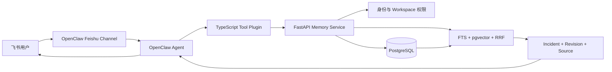

# RecallOps 面试完全手册

> 目标：看完后能够用结论先行的方式讲清项目价值、完整链路、关键取舍、记忆维护、权限安全和评测口径，并能应对连续追问。
>
> 使用原则：只描述当前代码、测试和离线评测能够证明的内容。真实飞书联调、真实 Embedding、线上规模和生成答案质量尚未完成，不得包装成已验证结果。

## 0. 快手式面试的回答方法

结合快手一面的追问方式，这类面试官通常不满足于“用了什么技术”，而会连续追问：

1. 你到底解决了什么任务？
2. 为什么这样设计，替代方案是什么？
3. 完整的数据流和事务边界是什么？
4. 异常、并发、权限和冲突时怎么办？
5. 效果如何定义，指标怎么算，失败样本是什么？

每个问题统一用四层结构回答：

```text
结论：一句话直接回答。
原因：指出业务矛盾或设计约束。
实现：只讲 2～3 个关键机制。
边界：说明当前限制和下一步验证方式。
```

避免以下表达：

- “我觉得可能是……”——改成“当前实现是……，原因是……”。
- “交给模型判断”——说明输入、输出、证据和失败边界。
- “效果很好”——给出数据集、指标定义、基线和失败类型。
- “支持百万级”——当前没有百万级压测，只能讨论扩展方案。
- “接入了飞书”——当前仓库完成插件与配置样例，真实企业凭据联调尚未验收。

## 1. 项目介绍话术

### 30 秒版本

> RecallOps 是一个研发故障记忆与混合检索系统。它解决的是故障信息散落在群聊和复盘文档中、同类问题重复排查的问题。写入侧不会自动保存所有聊天，而是先生成草稿，经用户确认后才成为正式记忆；查询侧在权限范围内结合全文和向量检索，返回历史根因、处理方案和来源证据。项目重点是让 Agent Memory 具备准入、权限、版本和评测，而不是简单把聊天写进向量库。

### 90 秒版本

> 我做 RecallOps 是因为研发故障通常散落在群聊和复盘文档里，同类问题再次发生时只能重新搜索，而且群聊中还包含大量未经证实的猜测。
>
> 系统分为 OpenClaw 工具插件和 FastAPI 记忆服务两部分。OpenClaw 负责话题会话、工具选择和可信请求人身份，后端负责权限、事务、检索、修订和评测。写入时先把话题内容整理成 Draft，只有 Maintainer 明确确认后，才在一个事务中写入故障、服务关系、来源、行动项和索引任务。修改正式结论不会直接覆盖，而是保留 Revision。
>
> 查询时先根据 Tenant、Workspace 和角色过滤数据范围，再执行 FTS 与向量召回，通过 RRF 融合。错误码和服务名等强标识符会优先保留，最终返回结构化事实和来源链接。离线评测覆盖精确查询、语义改写和无答案场景；当前结果表明 FTS 基线强于本地哈希向量，说明真实 Embedding 和阈值校准仍是下一步重点。

### 五分钟展开顺序

```text
第 1 分钟：业务问题、系统目标和明确不做什么
第 2 分钟：Draft → Confirm 的可信写入流程
第 3 分钟：FTS、向量、RRF 和强标识符优先
第 4 分钟：权限前置、Revision、索引重试和证据约束
第 5 分钟：评测口径、真实结果、失败分析和当前边界
```

## 2. 项目目标与边界

### 系统解决什么

- 把经过确认的故障现象、根因、方案和来源沉淀为长期记录。
- 新故障发生时，召回相似历史案例和排查方向。
- 支持正式记录修正、来源追溯、权限隔离和离线评测。

### 系统不解决什么

- 不自动保存全部群聊。
- 不自动判断当前故障一定与历史故障根因相同。
- 不让 LLM 自主决定用户权限。
- 不根据访问频率自动删除正式故障。
- 不用当前 160 条故障证明百万级扩展能力。
- 当前不声称完成真实飞书企业环境、生产 Embedding 或生成模型评测。

### 一句价值定位

> RecallOps 不替研发人员诊断故障，而是缩短发现可信历史经验和有效排查方向的时间。

## 3. 总体架构与职责边界



### OpenClaw 负责

- 飞书入口、话题级 Session 和回复路由。
- Agent 工具选择与结果投递。
- 向 Tool Plugin 提供可信 `requesterSenderId`。

### TypeScript Plugin 负责

- 注册 `incident_search`、`incident_draft`、`incident_commit`、`incident_get`、`incident_correct`。
- 从运行时读取身份，附加代理认证头和 `request_id`。
- 调用 FastAPI 并把结构化结果返回 Agent。

### FastAPI 负责

- 身份、角色和 Workspace 范围校验。
- Draft、Incident、Revision 和 Job 生命周期。
- 数据库事务、幂等、检索、证据和日志。

### 为什么要这样拆

> OpenClaw 擅长渠道和 Agent 编排，后端擅长确定性的事务、权限与数据治理。把 SQL、权限和事实版本放在 Agent 内，会使模型输出影响数据边界，也难以测试和审计。

## 4. 完整业务流程

### 4.1 故障沉淀流程

```text
用户在故障话题中请求沉淀
→ OpenClaw 选择 incident_draft
→ Plugin 注入可信身份并提交话题消息
→ 后端在当前 Tenant / Workspace 内计算 content_hash
→ 重复内容返回已有 Draft，否则生成结构化草稿
→ Agent 展示草稿，等待用户修改和确认
→ Maintainer 调用 incident_commit，并携带 request_id
→ 后端锁定 Draft，检查确认状态与请求幂等
→ 一个事务写入 Incident、Service 关系、Source、Action、Job 和 RequestRecord
→ Draft 标记为 committed
→ 返回稳定 Incident ID
```

#### 为什么需要人工确认

排查聊天中的“缓存问题”“网络抖动”等通常只是中间猜测。如果自动入库，错误结论会被后续 RAG 反复放大。Human-gated Memory 把模型输出定义为候选，把用户确认定义为事实准入。

#### 事务边界

正式提交要求以下内容一起成功或一起回滚：

- Incident 主记录；
- Service 与 IncidentService；
- Source 和 Action；
- Draft 状态；
- Embedding Job；
- `request_id` 对应的 RequestRecord。

当前代码使用 Draft 行锁处理并发确认，并将 RequestRecord 与正式写入放入同一事务。不同 `request_id` 重复确认同一 Draft 时仍返回同一 Incident。

### 4.2 历史查询流程

```text
用户描述新故障
→ Plugin 注入可信请求人身份
→ 后端校验代理凭据、Tenant、Workspace 和成员角色
→ 解析错误码、服务名和自然语言症状
→ 在授权范围内分别召回 FTS Top-50 和 Vector Top-50
→ 使用 RRF(k=60) 融合排名
→ 对精确错误码或服务标识符增加优先级
→ 应用可信结果阈值并截取最终 Top-K
→ 加载 Incident、Service、Revision、Action 和 Source
→ 返回证据包；无可信结果时返回空结果
```

### 4.3 正式记录修正流程

```text
Maintainer 提交字段、新值和修改原因
→ 校验 Incident 属于当前 Workspace
→ 读取当前值
→ 写入 Revision(old_value, new_value, reason, changed_by)
→ 更新当前有效值
→ index_status 标记 pending
→ 创建重新索引 Job
→ Worker 重建派生索引
```

### 4.4 索引失败流程

```text
核心事实先提交成功
→ 索引 Job 独立执行
→ 成功：index_status = ready
→ 失败：记录 attempts 和 last_error
→ 未超过次数：继续 pending
→ 达到上限：failed，等待人工处理
```

这样 Embedding 服务失败不会导致正式故障记录丢失，记录仍可通过 FTS 查询。

## 5. 记忆如何维护

### 生命周期

| 阶段 | 状态 | 维护方式 |
| --- | --- | --- |
| 草稿 | `pending` | 可修改、可过期，不参与正式检索 |
| 已确认 | `active` | 进入正式检索，保留来源与确认人 |
| 已修订 | `active` + Revision | 当前值更新，旧值和原因保留 |
| 待索引 | `index_status=pending` | Job 异步重建索引 |
| 已归档 | 设计目标 | 退出默认检索，但不物理删除 |
| 删除 | 合规/管理员流程 | 不以访问频率自动删除 |

### 为什么不自动遗忘正式故障

故障可能低频但高价值，访问频率不能代表业务价值。自动衰减适合短期上下文，不适合已经确认的事故事实。RecallOps 对正式记录采用修订和归档，而不是指数遗忘。

### 冲突事实怎么处理

不让模型直接覆盖。新结论必须带来源和修改原因，通过 Revision 保留新旧版本；如果来源权威性不足，应该进入待审核状态，而不是把冲突隐藏掉。

### Embedding 模型升级怎么办

正式 Incident 不变。使用 `embedding_model`、`embedding_version` 和 `index_status` 标记索引版本，批量创建重建 Job。生产化可采用双版本索引：新版本构建完成并验证后再切流，失败时继续使用旧版本。

### 如何防止重复记忆

- 事件重试：使用 `request_id`。
- 内容重复：在 Tenant + Workspace 范围内使用 `content_hash`。
- 相似但不相同：只提示相似历史案例，不依赖向量自动合并。

最后一点很重要：两个症状相似的故障可能有完全不同的根因，自动合并会破坏事实完整性。

## 6. 混合检索核心原理

### 为什么不用纯向量检索

错误码、服务名、接口路径和配置项具有强字面意义，语义模型可能把相近字符串混淆；自然语言症状又可能完全没有相同关键词。因此精确检索与语义检索互补。

### RRF 如何计算

对候选文档 `d`：

```text
RRF(d) = Σ 1 / (k + rank_i(d))
```

当前 `k=60`，分别取 FTS 与向量候选排名。RRF 只依赖名次，不要求全文分数和余弦相似度处在同一尺度。

### 强标识符优先如何实现

当前实现从查询 token 中识别与 Incident `error_codes` 或 `service_names` 完全相等的标识符。命中后在融合分上增加确定性优先项，确保错误码不会因为向量排名较低而跌出 Top-K。

这属于可解释的业务规则，但必须有边界：

- 只有完整标识符相等才触发；
- 未识别或疑似误识别时回退普通混合检索；
- 不根据标识符直接判断根因，只用于排序历史记录。

### 无答案怎么判断

当前基线对不同检索模式使用分数阈值：低于阈值的候选不返回。生产环境应在独立开发集上校准阈值，并结合查询类型、Top-1 与 Top-2 分差、来源完整性和业务风险决定是否拒答。

### 什么时候加 Reranker

只有离线错误分析表明“正确结果已进入候选集，但排序位置偏后”时才加。若正确结果根本没被召回，Reranker 无法解决问题；若当前排序已足够，增加模型只会提高延迟和成本。

## 7. 权限与安全

### 信任链

```text
飞书已认证用户
→ OpenClaw 运行时上下文
→ Tool Plugin requesterSenderId
→ 代理认证凭据
→ FastAPI WorkspaceMember 校验
→ 授权范围内 SQL 召回
```

### 为什么不能先全库召回再过滤

未授权数据可能已经进入候选集、日志或模型上下文，造成泄露；同时未授权结果会占据 Top-K，使授权结果被挤出。权限必须成为 FTS 和向量 SQL 的过滤条件。

### Header 能否伪造

普通请求头本身不可信。当前后端使用共享代理密钥确认调用方是受信 Plugin，再校验 WorkspaceMember。生产化应进一步使用短期签名 Token、mTLS 或网关鉴权，将 Tenant、Workspace、Sender 作为不可修改的签名 Claims，并限制后端只接受内部网络流量。

### Prompt Injection 怎么防

- Source 内容视为不可信证据，不进入 System Prompt。
- 工具只返回结构化字段和来源 ID。
- 回答规则明确禁止执行证据中的指令。
- Claim 必须绑定 Incident/Source；没有证据则返回 insufficient evidence。

## 8. Evidence-first RAG 的回答契约

建议把返回给 Agent 的内容理解为 Evidence Pack：

```json
{
  "incident_id": "INC-1024",
  "confirmed_facts": {
    "symptom": "...",
    "root_cause": "...",
    "resolution": "..."
  },
  "revisions": [],
  "sources": [{"source_id": "...", "source_url": "..."}],
  "retrieval": {"mode": "hybrid", "score": 0.03}
}
```

回答必须区分：

- 历史事实：历史 Incident 已确认的结论。
- 当前证据：本次故障已经观测到的数据。
- 推测：基于相似案例提出的排查方向。
- 待验证项：连接池、指标、日志等尚未获得的信息。

无结果与后端失败必须区分：

```text
无结果：没有找到达到可信阈值的历史案例。
后端失败：历史故障服务暂时不可用，不能判断是否存在案例。
```

## 9. 评测体系：必须完整讲清

### 数据集如何构造

当前离线基准包含：

- 160 条故障：10 条人工风格种子案例 + 150 条固定随机种子的合成案例。
- 960 条有答案查询：错误码、原始症状、服务+症状改写、根因、方案和短查询。
- 180 条无答案查询：来自与研发故障库无关的跨领域问题。
- 总计 1,140 条查询。

错误码查询通常只有一个 relevant Incident；相同根因、方案或症状可能对应多条故障，因此使用多相关文档 qrels。

### 指标定义

设查询 `q` 的相关故障集合为 `R_q`，系统 Top-5 结果为 `T_q`。

#### HitRate@5

```text
HitRate@5 = mean( I(T_q ∩ R_q ≠ ∅) )
```

表示有答案查询中，Top-5 至少命中一条相关故障的比例。

#### Recall@5

```text
Recall@5 = mean( |T_q ∩ R_q| / |R_q| )
```

表示每条查询的相关故障被 Top-5 覆盖了多少，再对查询取平均。

#### MRR

```text
MRR = mean( 1 / first_relevant_rank(q) )
```

只关注第一个相关结果出现的位置；未命中记为 0。

#### 无答案误召回率

```text
FalseRecall = 返回非空结果的无答案查询数 / 180
```

衡量系统在应该拒答时仍返回历史案例的比例。

#### P95 检索延迟

对每条查询的本地检索函数耗时排序，取 95 分位。它不包含网络、在线 Embedding、LLM 生成或飞书投递，因此只能写“检索 P95”，不能写“RAG 端到端 P95”。

### 最新结果

| 方案 | HitRate@5 | Recall@5 | MRR | 无答案误召回率 | 本机检索 P95 |
| --- | ---: | ---: | ---: | ---: | ---: |
| FTS | 99.17% | 93.96% | 99.17% | 3.33% | 20.43 ms |
| Vector | 57.19% | 46.37% | 44.94% | 1.67% | 20.61 ms |
| Hybrid | 96.15% | 89.02% | 88.87% | 5.00% | 21.03 ms |

### 应该如何解释结果

> 当前数据集包含大量错误码和字段改写，本地向量又是确定性哈希基线，因此 FTS 明显强于 Vector，Hybrid 也没有超过 FTS。这不是“混合检索效果提升”的证据，而是一个可复现基线。它说明下一步应该接入真实领域 Embedding、在开发集校准阈值，并对服务+症状改写和无答案误召回做针对性优化。

### 当前评测的不足

- 数据以合成为主，不能代表真实飞书表达分布。
- 当前没有严格 train/dev/test 切分，阈值存在对评测集过拟合风险。
- 没有在线 Embedding 和 LLM 生成，因此未评估完整 RAG 延迟。
- 尚未评估 Evidence Citation 正确率和回答事实支持率。
- 160 条故障不能验证百万级索引性能。

### 下一步怎么改

1. 使用脱敏真实故障与人工查询构造独立测试集。
2. train 用于数据准备，dev 用于 Top-K、阈值和 `k` 调参，test 只运行一次出最终结果。
3. 对失败样本分类：未召回、排序靠后、阈值误拒、无答案误召回、权限过滤错误。
4. 接入真实 Embedding 后重新跑三组对照。
5. 增加回答支持率、Citation 正确率、端到端延迟和成本。

## 10. 基于快手风格的高频追问与参考回答

### Q1：为什么要做这个项目，飞书搜索不够吗？

> 飞书搜索适合查已知关键词，但相似故障可能使用不同表述，而且群聊中包含大量猜测。RecallOps 的差异是把最终确认的根因、方案和来源结构化，再同时提供精确和语义检索。它不是替代飞书，而是在飞书入口上增加可信故障记忆层。

### Q2：为什么不自动保存所有聊天？

> 故障排查天然包含错误假设。自动保存会提高覆盖率，但会降低事实精度，并让错误记忆在后续回答中被放大，所以我选择牺牲部分写入效率，换取正式记忆的可信度。

### Q3：为什么用 Tool，不用每轮 Hook 自动检索？

> 并非每条消息都需要历史故障。显式 Tool 具有清晰 Schema，可记录何时调用、输入输出是什么，也方便离线回放和评测 Agent 是否正确选择工具。自动 Hook 可以做后续对照，但不适合作为第一版默认链路。

### Q4：为什么不用独立 Memory Agent？

> 当前业务只有一个对话角色和确定性的后端操作，额外 Agent 不增加业务能力，反而增加延迟、成本和一致性问题。记忆治理更适合由事务后端完成，而不是依赖另一个模型自主决策。

### Q5：为什么不用纯向量数据库？

> 系统不仅需要语义检索，还需要事务、外键、权限、修订、行动项和 FTS。PostgreSQL + pgvector 能在一个事实源内完成这些能力，避免关系库与向量库双写不一致。只有规模和吞吐成为明确瓶颈时才考虑拆分。

### Q6：Draft 到 Confirm 的事务怎么设计？

> 先锁定 Draft，检查角色、确认标志和 `request_id`。然后在同一事务中写 Incident、Source、Service 关系、Action、索引 Job、RequestRecord，并更新 Draft 状态。任何一步失败全部回滚；并发确认通过 Draft 行锁串行化。

### Q7：`request_id` 和 `content_hash` 有什么区别？

> `request_id` 解决同一个网络请求重试，语义是请求幂等；`content_hash` 解决不同请求携带相同内容，语义是内容去重。两者作用层次不同，不能互相替代。

### Q8：两个相似故障为什么不自动合并？

> 症状相似不代表根因相同。向量相似度只能用于提醒历史案例，自动合并可能破坏事实完整性，因此由用户决定新建、修订还是补充来源。

### Q9：Revision 是覆盖还是 append-only？

> 当前有效字段会更新，Revision 采用 append-only，保存旧值、新值、原因和修改人。查询默认返回当前值，审计和回溯读取 Revision。这样兼顾读取效率和历史可追溯性。

### Q10：Embedding 失败会不会导致记录无法查询？

> 不会。正式记录和索引 Job 先提交，Embedding 是派生索引。失败期间记录仍可通过 FTS 查询，Job 记录重试次数和错误，恢复后补建向量。

### Q11：RRF 为什么取 `k=60`？

> 60 是常见且相对平滑的初始值，目的是降低头部名次差异的过度放大。当前还没有独立开发集证明 60 最优，所以面试中我会把它描述为可复现基线参数，生产值应在 dev 集上调优。

### Q12：错误码和向量结果冲突时谁优先？

> 完整错误码精确命中优先，因为它的信息密度和确定性高于症状语义。当前是在 RRF 后加入确定性 exact-identifier boost；未完整命中时不触发，回退普通混合排序。

### Q13：identifier detector 怎么做？

> 入库时用规则提取形如大写字母、数字和下划线/短横线组成的错误码，并提取 `*-service` 服务名；查询时将 token 与结构化 error_codes、service_names 做完全匹配。当前没有覆盖 trace ID、接口路径和数据库错误码族，这是后续扩展点。

### Q14：无答案阈值怎么定？

> 当前是离线基线阈值，不声称最优。正确方法是准备独立 dev 集，在 Recall 与无答案误召回之间选择业务可接受点，然后在 test 集固定评估。故障场景更重视避免把相似症状误写成相同根因，因此阈值应偏保守。

### Q15：为什么权限必须在召回前？

> 召回后过滤时，敏感内容可能已经进入模型上下文或日志，而且会占用 Top-K。前置过滤同时解决安全泄露和授权结果被挤出的问题。

### Q16：用户能否伪造 Workspace Header？

> 普通客户端可以伪造 Header，所以后端不能只信 Header。当前通过代理密钥限制调用方，并再次校验 WorkspaceMember；生产环境应使用签名 Claims、mTLS 和内网访问控制，让身份字段不可被客户端修改。

### Q17：怎么防止历史消息中的 Prompt Injection？

> 历史消息作为证据字段，而不是系统指令；不拼入 System Prompt；回答规则要求只抽取事实并绑定 Source。即使来源里写“忽略之前指令”，也只是普通证据文本。

### Q18：没有结果时怎么回答？

> 返回“没有找到达到可信阈值的历史案例”，并给出需要补充的错误码、服务和指标。不能编造案例，也不能把服务故障解释成没有数据。

### Q19：为什么 FTS 比 Hybrid 指标更高？

> 当前数据包含大量错误码和字段级改写，天然有利于 FTS；向量是哈希基线，不具备真正语义能力。RRF 混入较弱向量信号后会影响排序和无答案判断，所以 Hybrid 未超过 FTS。这个结果说明评测真正暴露了问题，而不是为了简历制造提升数字。

### Q20：96.15% 到底是什么？

> 修正指标定义后，96.15% 是 Hybrid 的 HitRate@5，即 960 条有答案查询中 Top-5 至少命中一个相关 Incident 的比例；标准 Recall@5 是 89.02%，因为部分查询标注了多个相关故障。MRR 是 88.87%，无答案误召回率的分母是 180。

### Q21：P95 21 ms 包含哪些部分？

> 只包含本地检索函数：计算查询向量、两路排序、融合和阈值过滤。不包含网络、在线 Embedding、数据库远程调用、LLM 生成或飞书投递，所以只能称为“本机检索 P95”。

### Q22：160 条故障能说明扩展性吗？

> 不能。它只验证检索策略和系统正确性。百万级要另外验证 HNSW/IVFFlat 参数、过滤选择性、分区、连接池、并发、索引构建时间、内存和 P99。

### Q23：项目当前最大限制是什么？

> 最大限制是数据和模型都不是生产条件：数据主要是合成，向量是哈希基线，也没有真实生成评测。因此当前能证明的是架构闭环和可复现基线，不能证明线上业务收益。

### Q24：如果继续做，第一优先级是什么？

> 先引入一批脱敏真实故障和人工查询，建立独立 dev/test；然后接入真实领域 Embedding，按失败类型优化召回和阈值。没有可信评测集之前，继续堆 Reranker 或复杂 Agent 没有可靠依据。

### Q25：为什么不使用复杂知识图谱？

> 当前关系固定为 Incident、Service、Source、Action、Revision，普通关系表和 JOIN 足够。只有业务出现大量动态实体、多跳关系查询，并通过评验证明确增益时才值得引入图数据库。

### Q26：系统如何观测和排查失败？

> 当前有 RetrievalLog、Job attempts 和 last_error 等基础记录。生产化应统一 run_id/request_id，记录用户范围、查询类型、候选 ID、各路排名、阈值、耗时和错误分类，支持离线回放，而不是只看最终回答。

## 11. 连续追问链演练

### 链一：评测可信度

```text
效果怎么样？
→ 先报数据集和四个指标，不先报漂亮数字。

Ground truth 怎么来？
→ 10 条种子 + 150 条合成；错误码单相关，泛化查询多 qrels。

Recall@5 怎么算？
→ 区分 HitRate@5 和标准 Recall@5，给公式。

为什么没有切分？
→ 承认当前是基线缺陷，下一步 dev 调参、test 固定报告。

这些数字能证明线上有效吗？
→ 不能，只证明当前合成基准上的检索正确性。
```

### 链二：并发与幂等

```text
工具超时重试怎么办？
→ request_id 返回已有结果。

换了 request_id 但内容相同呢？
→ content_hash 在 Tenant + Workspace 范围去重。

两个 Maintainer 同时确认呢？
→ Draft 行锁串行化，事务中检查 committed 状态。

事务提交后响应丢了呢？
→ 重试通过 RequestRecord 或 Draft 的 incident_id 返回同一结果。

为什么不只用数据库唯一键？
→ 唯一键是最后防线，业务仍需返回稳定结果和明确语义。
```

### 链三：权限安全

```text
身份从哪来？
→ OpenClaw runtime context 的 requesterSenderId。

Header 能伪造吗？
→ 能，所以需要代理认证；生产改签名 Claims/mTLS。

为什么不能召回后过滤？
→ 上下文泄露 + Top-K 污染。

pgvector 怎么带权限过滤？
→ SQL WHERE 先限定 tenant/workspace/status，再按距离排序。

数据库管理员仍能看到数据怎么办？
→ 业务权限之外再加 RLS、审计和最小数据库权限。
```

### 链四：检索设计

```text
为什么混合？
→ 精确标识与语义症状互补。

为什么 RRF？
→ 不同分数量纲难直接加权，RRF 只依赖名次。

错误码冲突怎么办？
→ 完整标识符 exact boost，但只影响排序，不判断根因。

Hybrid 为什么没超过 FTS？
→ 哈希向量弱 + 数据偏精确线索，弱信号干扰融合。

怎么优化？
→ 真实 Embedding、独立 dev、按查询类型路由/加权、再判断是否需要 Reranker。
```

## 12. 失败分析框架

被问“为什么没命中”时，不要统一归因于模型能力，按下面分类：

| 失败类型 | 如何判断 | 优化方向 |
| --- | --- | --- |
| 查询解析失败 | 错误码/服务未识别 | 规则、字典、字段化解析 |
| 候选未召回 | relevant 不在两路 Top-K | Embedding、FTS 配置、Top-K |
| 融合排序失败 | relevant 在候选但最终靠后 | RRF 参数、查询类型路由、Reranker |
| 阈值误拒 | relevant 得分低于阈值 | dev 集校准、分类型阈值 |
| 无答案误召回 | no-answer 返回了案例 | 更严格阈值、置信度与证据完整性 |
| 权限过滤错误 | 相关记录不在授权范围或发生越权 | 身份链、Workspace 映射、RLS |
| 索引陈旧 | Revision 后仍命中旧语义 | index_status、Job 重试、版本切换 |
| 生成不受证据支持 | 回答出现 Evidence Pack 外事实 | Citation contract、生成评测 |

## 13. 当前实现与生产方案的边界

| 维度 | 当前实现 | 生产化方案 |
| --- | --- | --- |
| 飞书 | Plugin 与配置样例 | 真实企业应用、权限审批、消息拉取与验收 |
| 抽取 | 可复现规则抽取 | LLM 结构化输出 + Schema 校验 + 人工确认 |
| Embedding | 96 维哈希基线 | 领域 Embedding、版本治理和批量重建 |
| 身份 | 代理密钥 + WorkspaceMember | 短期签名 Claims、mTLS、内网网关 |
| 检索 | FTS / pgvector / RRF | 独立 dev/test、分类型阈值、必要时 Reranker |
| RAG | 结构化证据与回答策略 | Claim-Citation 约束和生成正确性评测 |
| 数据 | 160 条、合成为主 | 脱敏真实故障、人工 qrels、时间切分 |
| 性能 | 单机离线检索延迟 | 数据库并发、P99、索引构建和容量压测 |

## 14. 简历指标的安全口径

推荐表达：

> 在基于 160 条故障构造的 1,140 条离线查询上，Hybrid 的 HitRate@5 为 96.15%、标准 Recall@5 为 89.02%、MRR 为 88.87%、无答案误召回率为 5.0%；检索 P95 约 21 ms，仅统计本机检索链路。

不要表达：

- “混合检索将 Recall@5 提升到 96.15%”——当前 FTS 更高，且 96.15% 实际是 HitRate@5。
- “RAG 延迟 21 ms”——没有包含在线 Embedding 和生成。
- “支持百万级”——没有进行对应容量与并发压测。
- “线上误召回率 5%”——这是合成离线基准。

## 15. 代码证据索引

| 面试话题 | 代码入口 |
| --- | --- |
| API 与完整流程 | `memory-service/app/main.py` |
| 数据模型 | `memory-service/app/models.py` |
| Draft、Confirm 与事务 | `memory-service/app/service.py` |
| 权限与角色 | `memory-service/app/auth.py` |
| RRF、阈值和强标识符 | `memory-service/app/retrieval.py` |
| PostgreSQL FTS / pgvector | `memory-service/app/postgres.py` |
| OpenClaw 工具 | `openclaw-plugin/src/index.ts` |
| 可信身份 Header | `openclaw-plugin/src/client.ts` |
| 数据集生成 | `eval/generate_dataset.py` |
| 指标实现 | `eval/retrieval_eval.py` |
| 最新结果 | `eval/reports/latest.json` |

## 16. 面试前十分钟检查清单

- [ ] 能在 90 秒内讲完业务问题、写入、检索、权限和评测。
- [ ] 能画出 Draft → Confirm → Incident → Job 的事务流程。
- [ ] 能写出 RRF、HitRate@5、Recall@5 和 MRR 公式。
- [ ] 能解释 `request_id`、`content_hash`、Revision 的区别。
- [ ] 能解释权限为什么必须在召回前。
- [ ] 能说明 96.15% 是 HitRate@5，不是标准 Recall@5。
- [ ] 能说明 21 ms 只统计本机检索层。
- [ ] 能主动承认合成数据、哈希 Embedding 和无独立切分的限制。
- [ ] 能按失败类型分析，而不是统一归因于模型。
- [ ] 能说出下一步只优先做：真实数据集、真实 Embedding、独立 dev/test。

## 17. 最后的项目总结

> RecallOps 的核心不是“用了 pgvector”，而是把故障记忆做成可信的数据闭环：写入有人工准入，数据有幂等和版本，检索有精确与语义互补，权限在召回前执行，回答必须绑定证据，效果通过可复现评测暴露问题。当前版本证明了系统设计和端到端闭环，但生产效果仍需要真实飞书数据、领域 Embedding 和独立测试集验证。

