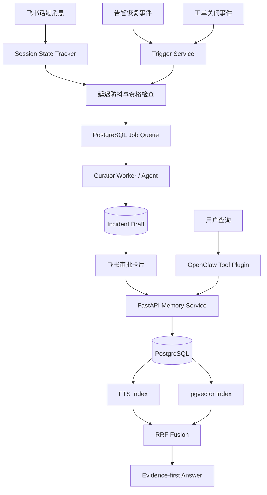

# RecallOps 项目设计文档

## 1. 项目定位

RecallOps 是面向研发团队的故障记忆生命周期系统。它不是普通的“文档入库后做 RAG”，而是处理以下问题：

1. 故障信息散落在飞书群聊、话题和复盘文档中。
2. 群聊同时包含猜测、被否定方案和最终结论，不能直接作为事实。
3. 多个用户和话题可能并发整理、确认和修正记忆。
4. 历史故障涉及 Workspace 权限和原始消息访问范围。
5. 故障结论会变化，需要保留事实演进而不是静默覆盖。

完整生命周期为：

```text
故障事件
→ 自动或手动触发整理
→ Curator Agent 生成候选 Draft
→ 负责人审批
→ 事务化写入正式记忆
→ 建立全文和向量索引
→ 权限内检索
→ 带证据回答
→ Revision 修订和重新索引
```

## 2. 核心边界

### Session

飞书群聊采用话题级 Session，而不是一个用户一个 Session：

```text
Tenant → Workspace → Group → Topic/Thread → Session
```

同一次故障的参与者共享话题上下文。用户身份只用于判断谁能生成 Draft、审批、查询和修订，不用于划分故障记忆。

### Draft

Draft 是 Agent 整理出的候选事实，可以修改、驳回和过期，但不参与正式检索。

### Incident

Incident 是经过审批的正式记忆，是系统的事实源。Embedding 只是可以重新生成的派生索引。

### Agent

Agent 负责理解上下文、提取候选字段和绑定证据，不负责权限判断、事务提交和事实审批。

## 3. 总体架构



在当前仓库中，OpenClaw Tool Plugin、FastAPI、Draft、审批、Incident、Revision、FTS、向量和评测已经实现；Trigger Service、Session State Tracker、延迟队列与 Curator Worker 是下一阶段设计。

## 4. 整理 Agent 如何触发

系统采用事件驱动，不周期性读取所有 Session 的全部聊天。

### 强触发

- 告警平台发送 `incident_resolved`。
- 故障工单变为 `resolved` 或 `closed`。
- 用户点击“生成故障总结”。
- 负责人在话题中发送约定的恢复标记。

### 弱触发

每次新消息只更新 Session 状态，并重置延迟检查时间：

```text
10:00 新消息 → 计划 10:30 检查
10:20 新消息 → 延后到 10:50
10:50 仍静默 → 执行整理资格检查
```

### 定时兜底

Sweeper 只检查状态表，用于恢复超时任务、发现遗漏触发和提醒过期 Draft，不重新扫描全部飞书历史。

### 整理资格

进入队列前检查：

- 是否来自白名单群和合法 Workspace；
- 是否出现故障现象和恢复信号；
- 是否具备最低消息量和原始来源；
- 是否已存在活跃 Draft 或已沉淀 Incident；
- 是否已经处理到当前消息游标。

## 5. 队列与并发模型

小规模阶段使用 PostgreSQL Job 表即可：

```sql
SELECT id
FROM jobs
WHERE status = 'pending'
ORDER BY created_at
FOR UPDATE SKIP LOCKED
LIMIT 1;
```

多个 Worker 可以领取不同 Session 的任务：

```text
Session A → Worker 1
Session B → Worker 2
Session C → Worker 3
```

同一个 Session 必须串行。Worker 开始前锁定 Session 状态行，保存 `processing_cursor`；处理期间到达的新消息只设置 `dirty=true`，当前任务结束后再增量刷新原 Draft，不并发创建第二份。

任务幂等键为：

```text
tenant_id + workspace_id + thread_id + source_cursor
```

Worker 崩溃时通过任务租约超时重新领取，多次失败后进入 dead-letter 状态等待人工检查。

## 6. Curator Agent 的输入与输出

### 输入

Agent 只能读取当前话题、当前消息窗口和当前用户有权访问的复盘材料。每条来源保存：

```text
message_id、sender_id、timestamp、content、source_url
```

### 输出

Agent 输出结构化 Draft：

```json
{
  "title": "支付回调积压导致订单状态未更新",
  "symptom": "支付成功但订单长时间未更新",
  "root_cause": "连接池参数配置不合理",
  "resolution": "扩容连接池并重启消费者",
  "services": ["payment-service"],
  "error_codes": ["PAYMENT_5032"],
  "actions": ["增加连接池使用率告警"],
  "uncertainties": [],
  "evidence": [
    {"field": "root_cause", "message_id": "msg-1024"}
  ]
}
```

关键约束：

- 区分事实、猜测、已排除项和待验证项；
- 根因与方案必须绑定原始证据；
- 信息不足时输出“待确认”，不能补造结论；
- 存在冲突时展示冲突，不替用户静默选择。

## 7. Draft 如何暂存和保持唯一

Agent 结果保存在 PostgreSQL `incident_drafts`，不保存在 Agent Session 内存，也不进入正式向量索引。

Draft 状态机：

```text
scheduled → processing → pending_review → approved → committed
                              ├→ rejected
                              ├→ needs_more_info
                              └→ expired
```

通过四层机制保证一个 Session 不出现多个活跃 Draft：

1. 任务唯一键阻止重复触发。
2. Session 行锁阻止两个 Worker 同时整理。
3. 部分唯一索引限制一个话题只能有一个活跃 Draft。
4. `content_hash` 阻止相同消息快照重复生成。

建议的数据库约束：

```sql
CREATE UNIQUE INDEX uq_active_draft_per_thread
ON incident_drafts(tenant_id, workspace_id, thread_id)
WHERE status IN ('processing', 'pending_review', 'needs_more_info');
```

如果等待审批时出现新消息，更新同一个 `draft_id`，增加 `draft_version` 并重新通知审批，而不是创建第二个 Draft。Incident 已经提交后出现的新结论，则进入 Revision 流程。

## 8. 审批策略

飞书审批卡片支持：

```text
通过并入库 / 修改后入库 / 要求补充 / 驳回
```

默认必须人工审批：

- 最终根因；
- 解决方案；
- 影响范围；
- 责任归属；
- 高严重等级故障。

可以自动确认的低风险字段包括告警 ID、发生时间、恢复时间、服务名、错误码和来源链接。

如果企业已经把正式复盘或已关闭工单定义为权威事实源，可以配置条件自动审批，但必须满足字段完整、证据齐全、没有冲突、审批策略已启用，并记录：

```text
approved_by = policy:<policy_id>
approval_reason
source_document
approval_time
```

原则是：结构化元数据可以自动化，根因和方案等语义结论默认由人确认。

## 9. 正式写入

审批请求携带可信身份、`draft_id`、`confirm=true` 和 `request_id`。后端依次检查：

1. 用户是否属于当前 Tenant 和 Workspace；
2. 是否具有 Maintainer 权限；
3. Draft 是否存在、未过期且尚未提交；
4. `request_id` 是否已经处理；
5. 修改后的必要字段和证据是否完整。

后端锁定 Draft，在同一事务内写入：

```text
Incident、Service、IncidentService、Source、Action、RequestRecord、Index Job
```

然后把 Draft 更新为 `committed`。任意一步失败全部回滚；多人同时确认时，Draft 行锁和请求幂等保证只生成一个 Incident。

## 10. 检索与回答

用户查询时，OpenClaw 运行时注入可信用户身份，后端先计算授权范围，再在 SQL 中完成 Workspace、服务、时间和角色过滤。

检索流程：

```text
查询解析
├→ FTS：错误码、服务名、接口路径等精确线索
└→ Vector：症状描述和自然语言改写
          ↓
       RRF 融合
          ↓
强标识符优先与置信阈值
          ↓
相关 Incident + Source Evidence
```

回答遵守 Evidence-first Contract：

- 历史事实绑定 Incident 和 Evidence ID；
- 当前现象与历史结论分开描述；
- 推测明确标记为待验证；
- 无可信结果时返回证据不足；
- 返回用户有权访问的原始飞书来源。

## 11. 记忆维护

正式记忆不会因为访问频率低而自动遗忘。故障记忆低频但可能高价值，采用修订和归档而不是指数衰减。

结论变化时创建 Revision：

```text
incident_id、field、old_value、new_value、reason、changed_by、changed_at
```

Revision 提交后创建重新索引任务。正式 Incident 始终是事实源，因此 Embedding 模型升级、索引损坏或任务失败都可以重新构建，不影响原始记录和证据。

## 12. 评测设计

当前离线数据包含 160 条故障和 1,140 条查询：

- identifier：错误码、服务名等精确查询；
- paraphrase：相同症状的不同自然语言描述；
- no-answer：知识库中不存在相关故障的查询。

指标：

| 指标 | 含义 |
|---|---|
| HitRate@5 | Top-5 是否至少命中一个相关故障 |
| Recall@5 | Top-5 找回全部相关故障的平均比例 |
| MRR | 第一个相关结果是否靠前 |
| 无答案误召回率 | 没有答案时是否仍返回可信结果 |
| 检索 P95 | 检索链路的尾部延迟 |

当前 Hybrid 结果：

```text
HitRate@5             96.15%
Recall@5              89.02%
MRR                   88.87%
无答案误召回率          5.0%
本机检索 P95           约 21 ms
```

这些结果只验证当前离线检索策略，不代表飞书端到端延迟或百万级容量。当前向量基线为本地哈希向量，真实生产效果还需要领域 Embedding、真实故障数据和独立测试集验证。

## 13. 当前实现与下一阶段

| 能力 | 当前状态 |
|---|---|
| OpenClaw Tool Plugin | 已实现 |
| 话题消息创建 Draft | 已实现，当前为显式调用 |
| 人工确认和权限检查 | 已实现 |
| 幂等、内容去重、并发确认 | 已实现 |
| Revision 与重新索引任务 | 已实现 |
| FTS、向量和 RRF 检索 | 已实现 |
| 离线评测 | 已实现 |
| 告警/工单事件 Trigger | 待实现 |
| Session State Tracker | 待实现 |
| 延迟防抖和 Job Worker | 待实现 |
| 自动更新同一 Draft 版本 | 待实现 |
| 条件自动审批策略 | 待实现 |
| 真实企业飞书验收 | 待实现 |

## 14. 一句话总结

> RecallOps 以故障话题为短期 Session，通过事件触发 Curator Agent 自动整理候选记忆，将事实审批、权限、并发和版本控制交给后端，再通过权限前置的混合检索和证据约束复用历史经验；Agent 降低整理成本，但不替用户确认事实。
