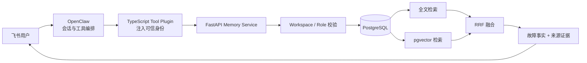

> 本文记录旧版 PostgreSQL/pgvector 设计。当前可运行的 MySQL + RabbitMQ 后端请从 [README](../README.md) 和 [后端实验记录](backend_experiments_20260925.md) 开始；下文的架构图与 8000 端口不适用于当前 Compose。

# RecallOps 项目快速上手

## 1. 一句话理解

RecallOps 是一个面向研发团队的故障记忆系统：将群聊中的故障信息整理成待确认草稿，经人工确认后保存为正式记录；新故障发生时，在用户有权访问的数据范围内检索相似案例，并返回历史根因、处理方案和来源证据。

系统不替研发人员自动判断当前故障的根因，只负责提供可信的历史经验和排查方向。

## 2. 它解决什么问题

研发故障通常分散在群聊、话题和复盘文档中，存在三个问题：

- 关键词不同：历史记录写“支付回调超时”，新问题可能描述为“付款后订单一直没更新”。
- 信息不可信：群聊包含大量未被证实的排查猜测，不能全部沉淀为长期知识。
- 数据有边界：不同团队和项目的故障信息不能先全库召回，再交给模型过滤。

RecallOps 因此围绕三条原则设计：

1. **先确认再入库**：模型或规则只能生成候选草稿，用户确认结果才是正式事实。
2. **先授权再检索**：权限过滤是检索条件，而不是召回后的补救措施。
3. **先证据再回答**：结果必须带来源；证据不足时明确拒答。

## 3. 系统如何工作



### 写入链路

```text
飞书话题消息
→ 生成结构化草稿
→ 用户检查和修正
→ 显式确认
→ 事务写入故障、服务、来源、行动项和索引任务
→ 生成或重建检索索引
```

草稿不会参与正式检索。重复话题内容通过 `content_hash` 去重，重复工具请求通过 `request_id` 保证幂等。

### 查询链路

```text
获取可信用户身份
→ 校验 Workspace 成员与角色
→ 解析错误码、服务名和自然语言症状
→ FTS 与向量检索召回候选
→ RRF 融合并保留强标识符优先级
→ 返回结构化故障与来源链接
```

FTS 适合错误码、服务名和配置项；向量检索适合症状改写；RRF 使用排名而不是直接混合两种不同量纲的分数。

## 4. 核心设计

### Human-gated Memory

排查过程中的“可能是网络”“可能是缓存”等猜测不能直接成为长期知识，因此系统将抽取结果先保存为 Draft。只有具备权限的用户显式确认后，才生成正式 Incident。

### PostgreSQL 是事实源

正式故障、来源、服务关系和修订记录保存在关系表中。Embedding 只是可重建的派生索引：模型升级或索引损坏时，可以从正式记录重新生成，不影响业务事实。

### 幂等与历史修订

- `request_id`：处理工具超时和网络重试，避免相同请求重复提交。
- `content_hash`：识别内容相同的草稿或来源。
- Transaction：保证故障、来源、服务关系、行动项和索引任务原子写入。
- Revision：修改正式结论时保留旧值、新值、原因和修改人，而不是静默覆盖。

### 权限前置

OpenClaw Plugin 从运行时上下文读取 `requesterSenderId`，模型参数中不提供可覆盖的用户身份。FastAPI 根据 Tenant、Workspace 和成员角色计算访问范围，两路检索都在该范围内执行。

### Evidence-first RAG

工具返回已确认的故障字段、Revision、Source URL 和检索分数。Agent 只能依据这些证据组织回答；无可信结果时返回证据不足，后端异常时返回服务不可用，不能把两者混为一谈。

## 5. 目录导航

```text
recallops/
├─ memory-service/            FastAPI 后端
│  ├─ app/main.py             API 路由与请求流程
│  ├─ app/models.py           数据模型
│  ├─ app/service.py          草稿生成与确认入库
│  ├─ app/retrieval.py        本地检索、RRF 与阈值
│  ├─ app/postgres.py         PostgreSQL FTS / pgvector 查询
│  ├─ app/auth.py             身份、角色和 Workspace 校验
│  └─ tests/                  工作流和权限测试
├─ openclaw-plugin/           TypeScript OpenClaw 工具插件
│  ├─ src/index.ts            五个工具定义
│  └─ src/client.ts           可信身份头与 API Client
├─ eval/                      数据生成与检索评测
│  ├─ generate_dataset.py     可复现合成数据集
│  ├─ retrieval_eval.py       FTS / Vector / Hybrid 对照
│  └─ reports/latest.json     最新评测结果
├─ scripts/demo.ps1           端到端演示
├─ openclaw.example.json5     Feishu / OpenClaw 配置样例
└─ docker-compose.yml         PostgreSQL、pgvector 与 API
```

推荐阅读顺序：

1. `memory-service/app/main.py`：先看系统提供哪些能力。
2. `memory-service/app/service.py`：理解 Draft 如何转化为 Incident。
3. `memory-service/app/retrieval.py`：理解 FTS、向量和 RRF 的分工。
4. `memory-service/app/auth.py`：理解为什么权限必须进入查询条件。
5. `openclaw-plugin/src/index.ts`：理解 OpenClaw 如何调用后端。

## 6. 五分钟运行

### 启动服务

```powershell
Set-Location recallops
Copy-Item .env.example .env
docker compose up --build
```

启动后检查：

```text
健康检查：http://localhost:8000/health
API 文档：http://localhost:8000/docs
```

### 运行端到端 Demo

另开 PowerShell 7 终端：

```powershell
Set-Location recallops
pwsh -File scripts/demo.ps1
```

脚本会依次完成：

1. 创建演示租户、Workspace 和 Maintainer。
2. 根据示例故障消息生成 Draft。
3. 确认并提交正式 Incident。
4. 使用自然语言查询相似历史故障。
5. 输出根因、方案、服务关系、行动项和来源链接。

## 7. 主要 API

| API | 用途 | 最低角色 |
| --- | --- | --- |
| `POST /v1/drafts` | 从话题消息创建待确认草稿 | Member |
| `POST /v1/incidents` | 确认草稿并提交正式记录 | Maintainer |
| `POST /v1/incidents/search` | 搜索历史故障 | Viewer |
| `GET /v1/incidents/{id}` | 查询故障详情与来源 | Viewer |
| `PATCH /v1/incidents/{id}` | 修正正式记录并创建 Revision | Maintainer |
| `POST /v1/jobs/run` | 执行待处理索引任务 | Admin |

后端要求可信代理密钥以及 Tenant、Workspace、用户身份头。生产环境不能向公网开放 `/dev/bootstrap`。

## 8. 测试与评测

### 后端测试

```powershell
python -m pip install -r memory-service/requirements.txt
Set-Location memory-service
python -m pytest -q
```

测试覆盖人工确认、草稿去重、请求幂等、来源证据、Workspace 隔离、身份拒绝、Revision、索引重建和无答案拒答。

### 插件测试

```powershell
Set-Location openclaw-plugin
npm install --legacy-peer-deps
npm run build
npm test
```

### 检索评测

```powershell
Set-Location recallops
python eval/generate_dataset.py
python eval/retrieval_eval.py
```

当前合成基准包含 160 条故障和 1,140 条查询，覆盖精确标识、语义改写、根因、方案和无答案场景。最新混合检索结果为：

- HitRate@5：96.15%
- Recall@5：89.02%
- MRR：88.87%
- 无答案误召回率：5.0%
- 检索 P95：以 `eval/reports/latest.json` 的当前机器实测为准

这些指标只描述本地可复现的检索基准，不能证明线上效果或百万级扩展能力。

## 9. 当前边界

- 仓库提供 OpenClaw Plugin 和 Feishu 配置样例，但真实飞书验收仍需要企业应用凭据、群授权和实际消息权限。
- 本地评测使用确定性哈希 Embedding，目的是无需模型密钥即可复现；生产环境需要接入真实 Embedding 模型并重新评测。
- 当前系统返回结构化证据和回答约束，不负责自动诊断当前故障根因。
- 当前数据集以合成数据为主，应进一步使用脱敏、人工标注的真实故障记录验证效果。
- PostgreSQL + pgvector 的百万级能力需要结合真实数据分布、过滤选择性、索引参数和并发压测评估。

## 10. 面试时如何介绍

可以用下面的主线展开：

> 我没有把 Agent Memory 做成自动追加聊天内容的向量库，而是把它当作需要准入、权限、版本、证据和评测的数据系统。写入侧通过人工确认避免猜测污染；查询侧结合精确与语义检索；回答侧要求来源证据；维护侧通过幂等、Revision 和可重建索引保证长期可靠性。

最值得展开的五个问题：

1. 为什么故障记忆必须先生成 Draft，再人工确认？
2. 为什么错误码查询不能只依赖向量检索？
3. 为什么权限过滤必须发生在召回之前？
4. `request_id`、`content_hash` 和 Revision 分别解决什么问题？
5. 如何定义 Recall@5、MRR 和无答案误召回率？
